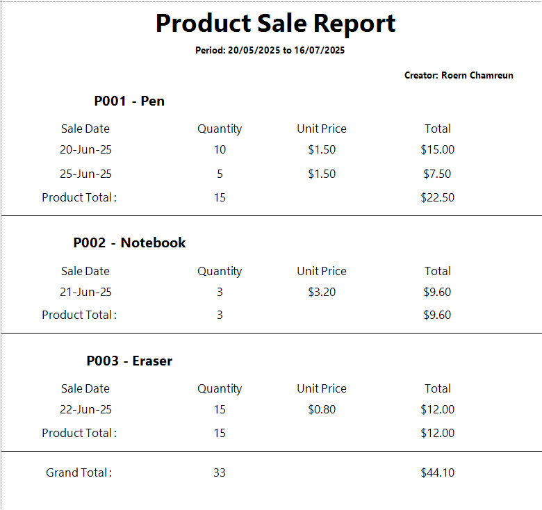
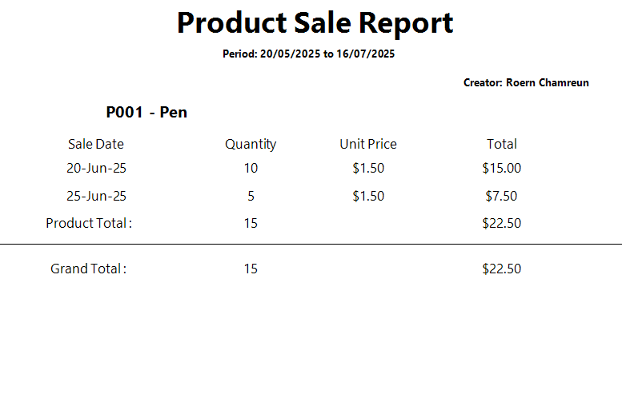

# Product Sales Reporting Tool

A WinForms application that connects to SQL Server database to fetch, filter, and display product sales data using DevExpress XtraReport with grouping, totals, and dynamic date filtering.

## 🎯 Features

- **Date Range Filtering:**: Select start and end dates to filter sales data
- **Filter by ProductName:** Support Filter by Product Name (Optional Field)
- **DevExpress Reporting:**: Professional reports with grouping by product code
- **Report Parameters in Header:** Have period between start and end date in the header
- **Stored Procedure:** Data access via stored procedure
- **Logging**: Comprehensive error logging using Serilog
- **Export Options:**: Export reports to PDF
- **Khmer Font Support:** Via unicode friendly font "Segoe UI font"
## 🛠️ Technology Stack

- **.NET 8.0** - Windows Forms Application
- **SQL Server** - Database
- **DevExpress XtraReport 25.1.3** - Reporting engine
- **ADO.NET** - Database connectivity
- **Serilog** - Logging framework
- **Microsoft.Data.SqlClient** - SQL Server data provider

## 📋 Prerequisites

Before running this application, ensure you have:

1. **Visual Studio 2022** or later
2. **.NET 8.0 SDK** installed
3. **SQL Server** (LocalDB, Express, or full version)
4. **DevExpress Trial License** (version 25.1.3 or above)

### DevExpress Setup

⚠️ **Important**: This application uses DevExpress XtraReport components. You need to:

1. Download and install **DevExpress Universal Trial** from [DevExpress website](https://www.devexpress.com/products/try/)
2. Ensure you get version **25.1.3** or above
3. The trial is free for 30 days and includes all necessary components

## 🚀 Setup Instructions

### 1. Clone the Repository

```bash
git clone [your-repository-url]
cd product-sales-reporting-tool
```

### 2. Database Setup

Execute the following SQL script in your SQL Server Management Studio or any SQL client:

```sql
-- Create Database (if not exists)

-- Please create this one by one not all at the same time
CREATE TABLE PRODUCTSALES (
    SALEID INT PRIMARY KEY,
    PRODUCTCODE NVARCHAR(20),
    PRODUCTNAME NVARCHAR(100),
    QUANTITY INT,
    UNITPRICE DECIMAL(18,2),
    SALEDATE DATE
);

-- Index for sale date filtering
CREATE INDEX idx_sale_date
ON PRODUCTSALES (SALEDATE);

-- Stored procedure for filtering via dates and optional parameter for product name
CREATE PROCEDURE GetProductBetweenDatesAndFilterByName
@StartDate DATE,
@EndDate DATE,
@ProductName NVARCHAR(100) = NULL
AS
BEGIN
    SELECT PRODUCTNAME,PRODUCTCODE,QUANTITY,UNITPRICE,
    (QUANTITY * UNITPRICE) AS TOTAL ,
    SALEDATE FROM PRODUCTSALES 
    WHERE 
    SALEDATE BETWEEN @StartDate AND @EndDate 
    AND 
    (@ProductName IS NULL OR PRODUCTNAME LIKE '%' + @ProductName + '%');
END;


-- Sample Data
INSERT INTO PRODUCTSALES (SALEID, PRODUCTCODE, PRODUCTNAME, QUANTITY,
UNITPRICE, SALEDATE)
VALUES
(1, 'P001', 'Pen', 10, 1.50, '2025-06-20'),
(2, 'P001', 'Pen', 5, 1.50, '2025-06-25'),
(3, 'P002', 'Notebook', 3, 3.20, '2025-06-21'),
(4, 'P003', 'Eraser', 15, 0.80, '2025-06-22');
```

### 3. Configuration

Update the `appsettings.json` file with your SQL Server connection string:

```json
{
  "ConnectionStrings": {
    "DefaultConnection": "Server=ROA_LOCAL_;Database=Tonaire_analytical_tool;Trusted_Connection=True;TrustServerCertificate=True;"
  },
  "Serilog": {
    "MinimumLevel": "Information"
  }
}
```

**Connection String Examples:**
- **LocalDB**: `Server=(localdb)\\MSSQLLocalDB;Database=YourDatabase;Trusted_Connection=True;TrustServerCertificate=True;`
- **SQL Server Express**: `Server=.\\SQLEXPRESS;Database=YourDatabase;Trusted_Connection=True;TrustServerCertificate=True;`
- **Full SQL Server**: `Server=YOUR_SERVER_NAME;Database=YourDatabase;Trusted_Connection=True;TrustServerCertificate=True;`

### 4. Build and Run

1. Open the solution in Visual Studio
2. Restore NuGet packages (should happen automatically)
but if does work you this command in the terminal
`
dotnet restore 
`
3. Build the solution (`Ctrl+Shift+B`)
4. Run the application (`F5`)

## 📂 Project Structure

```
├── Dtos/
│   └── SaleDto.cs              # Data transfer object
├── Config/
│   └── LoggerConfig.cs         # Serilog Config
│   └── ConfigLoader.cs         # Load Configuration
├── logs/                       # It will create this folder if not exist
│   └── errors{the time it was created}.cs  # if there an error it will create this file 
│
├── Services/                   # Business logic
│   └── SalesService.cs         
├── Repo/                       # Data access layer
│   └── SaleRepo.cs             
├── Reports/
│   └── SalesReport.cs          # DevExpress XtraReport
├── Forms/
│   └── SaleReportForm.cs       # Sale WinForms UI
├── appsettings.json            # Configuration file
├── AppDb.json                  # Database Connection
└── Program.cs                  # Entry point
```

## 🎮 How to Use

1. **Launch the application**
2. **Select Date Range**: Choose start and end dates using the DateTimePicker controls
3. **Generate Report**: Click the "Generate Report" button
4. **View Results**: The report will display with:
   - Products grouped by product code
   - Total quantity sold per product
   - Total revenue per product
   - Grand totals at the bottom
5. **Export** (if implemented): Use export buttons to save as PDF

## 🔧 Error Handling & Logging

- **Validation**: Input validation for date ranges
- **Error Logging**: All errors logged to `logs/errors{time of creation}.txt` using Serilog
- **Connection Errors**: Graceful handling of database connection issues

## 🛑 Troubleshooting

### Common Issues:

1. **DevExpress License Error**
   - Ensure DevExpress trial is properly installed
   - Check that version 25.1.3 or above is installed

2. **Database Connection Error**
   - Verify SQL Server is running
   - Check connection string in `appsettings.json`
   - Ensure database exists and table is created

3. **Build Errors**
   - Restore NuGet packages
   - Ensure .NET 8.0 SDK is installed
   - Check DevExpress references

## 📝 Notes

- Serilog is configured for file logging with minimum level as information level
- All SQL queries use stored procedure

## 🔗 Dependencies

All required NuGet packages are included in the `.csproj` file:
- DevExpress.Data (25.1.3)
- DevExpress.Reporting.Core (25.1.3)
- DevExpress.Win.Reporting (25.1.3)
- Microsoft.Data.SqlClient (6.0.2)
- Microsoft.Extensions.Configuration.* (9.0.7)
- Serilog packages (4.3.0+)

##  Output Example
- Output 1 (Product name is not provided)

  

- Output 1 (Provided product name in the text box)
 
---

**Developer**: Roern Chamreun [Roa]  
**Date**: 7 July 2025  
**Framework**: .NET 8.0 WinForms with DevExpress XtraReport
